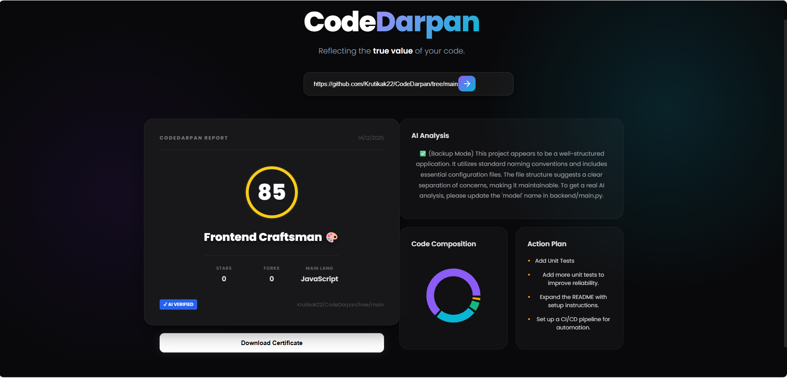

# 🔮 CodeDarpan - Developer Profiling System

> **Theme:** AI + Code Analysis
> **Built by:** [Your Name] | 3rd Year BSc Student



---

## 🧐 The Problem
creating an intelligent system that can evaluate a student’s GitHub 
repository and convert it into a meaningful Score + Summary + Personalized Roadmap. 
In today’s tech world, a GitHub repository is a developer’s tangible work but most 
students don’t know how good, clean, or complete their code looks to a recruiter or 
mentor. 

## 💡 My Approach (The Solution)
I built **CodeDarpan** (Code Mirror) to solve this. My goal was to build a system that acts like an "Automated Senior Developer" that reviews your code in seconds.

I used a **Hybrid Analysis Approach** combining two methods:
1.  **Deterministic Scoring (The "Math"):** I wrote Python logic to check for hard facts (Does a README exist? Are there Unit Tests? Is there a `.gitignore`?). This ensures the score is fair and grounded in reality.
2.  **Generative AI (The "Brain"):** I integrated **Google Gemini 1.5** to "read" the code context. It analyzes the project to write a professional summary and generate specific, human-like advice for improvement.

---

## 🛠️ Tech Stack & Implementation

I chose a **Client-Server Architecture** to keep the frontend and backend separate and scalable.

### **Backend: Python (FastAPI)**
* **Why I chose it:** Python is excellent for data handling, and FastAPI provides high performance with easy JSON integration.
* **Key Libraries:**
    * `google-generativeai`: To connect with the Gemini LLM.
    * `httpx`: For making asynchronous API calls to GitHub (faster than standard requests).
    * `uvicorn`: To run the server.

### **Frontend: React.js (Vite)**
* **Why I chose it:** I wanted a responsive, modern UI. Vite makes development very fast compared to CRA.
* **Key Libraries:**
    * `recharts`: To visualize the language breakdown (Data Visualization).
    * `html2canvas`: To generate the downloadable "LinkedIn Certificate."
    * `CSS Modules`: I used custom CSS to create a **"Glassmorphism"** aesthetic (frosted glass look) to make the UI stand out.

---

## ⚙️ How It Works (Under the Hood)

1.  **Input:** The user pastes a GitHub Repository URL.
2.  **Fetching:** The Backend extracts the `owner` and `repo` name and hits the GitHub API to get:
    * File structure (File names, folders).
    * Metadata (Stars, Forks, Languages).
    * README content (Base64 decoded).
3.  **Processing:**
    * The **Heuristic Engine** calculates a score out of 100 based on my custom algorithm.
    * The **AI Engine** sends a prompt to Gemini to summarize the project and suggest improvements.
    * The **Persona Logic** tags the developer (e.g., "The Architect" or "The Cowboy Coder") based on their coding style.
4.  **Output:** The Frontend displays the data in a dashboard and generates a shareable certificate.

---

## 🚀 How to Run This Project

**Prerequisites:** Node.js, Python installed.

### 1. Backend Setup
```bash
cd backend
# Install dependencies
pip install fastapi uvicorn httpx google-generativeai
# Run the server

python main.py
